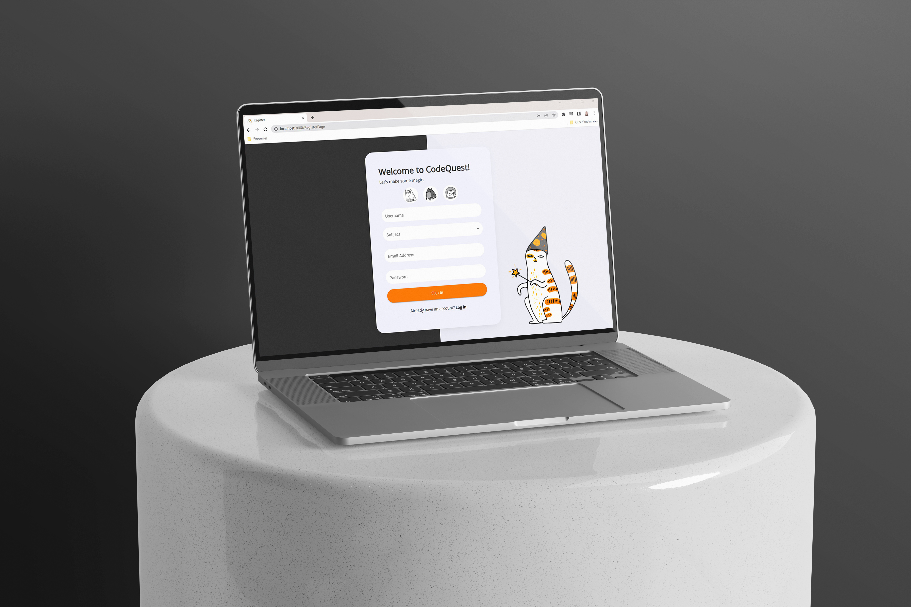
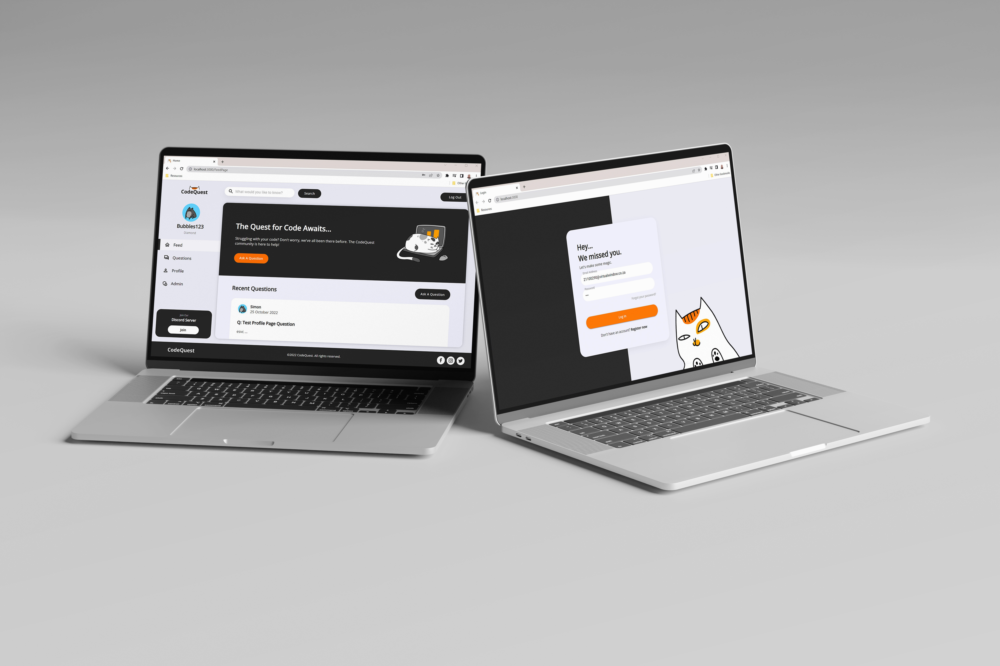
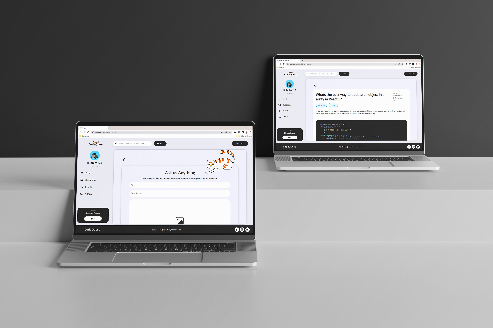
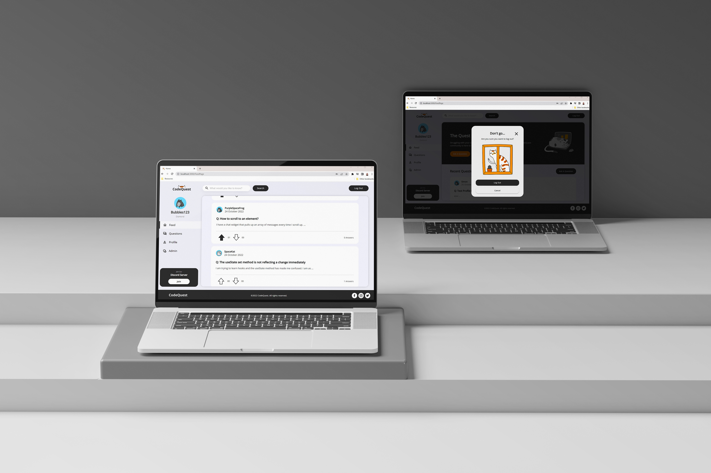
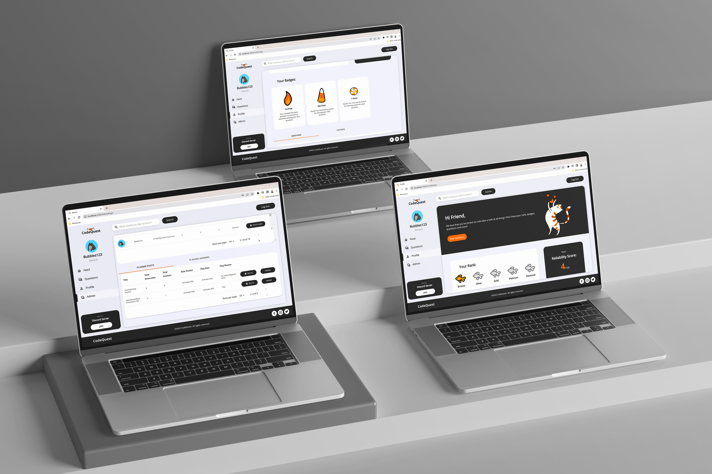
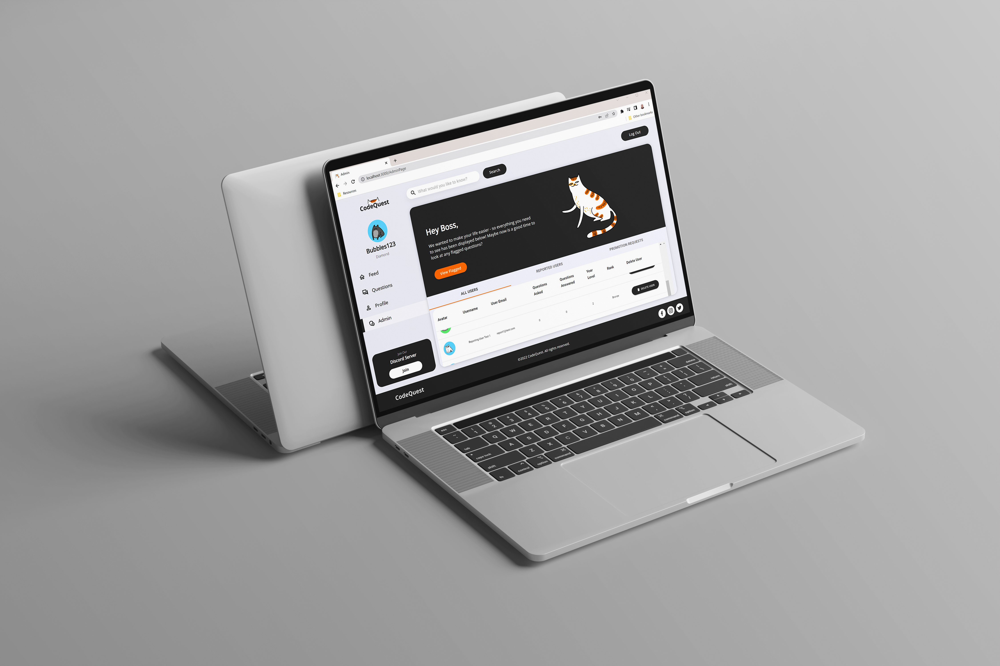

# CodeQuest
 CodeQuest - Team 4 Full MERN stack application for DV200

 

 
<!-- 

 -->

<!-- HEADER SECTION -->
<h3 align="center" style="padding:1;margin:0;"> Designed & Developed by:</3>
<h5 align="center" style="padding:1;margin:0;">Alexa Pettitt</5>
<h5 align="center" style="padding:1;margin:0;">Shanré Scheepers</5>
<h5 align="center" style="padding:1;margin:0;">Simon Riley</5>
<h5 align="center" style="padding:1;margin:0;">Priscilla Tabethe</5>
<h5 align="center" style="padding:1;margin:0;">Thato Khoza</5>

<h6 align="center">DV 200 | Term 4 | 2022 </5>
 

## Table of Contents

* [About The Project](#about-the-project)
    * [Project Description](#project-description)
    * [Built With](#built-with)
 * [Getting Started](#getting-started)  
    * [Prerequisites](#prerequisites)
    * [How To Install](#how-to-install)
* [Development Process](#developmentProcess)
* [Final Outcomes](#developmentProcess)
* [License](#license)
* [Contact](#contact)
* [Acknowledgements](#acknowledgements)

 
<!-- PROJECT DESCRIPTION -->
## About the Project
We were tasked with creating a complete MERN Stack application that would allow Open Window students to ask and answer code-related questions. Students can rate these, and if their reliability score increases - they can move up in rank.

With this being said - we wanted to create a website that embodied Open Windows playfulness and quirky qualities. While still ensuring a motivating and good user experience that would encourage student participation.

### Project Description
Code Quest is a full MERN stack application that encourages code collaboration! Giving users the opportunity to ask and answer code related questions and get rewards in return!

### Built With
* [React]
* [MUI]
* [MONGODB]

<!-- GETTING STARTED -->
## Getting Started
The following steps and isntructions will allow you to copy the project on your local machine for development, practising and testing purposes.

### How to Install
List 
### Installationile | Open...` from the menu.
In the project directory, you can run:

### `npm start`

Runs the app in the development mode.\
Open [http://localhost:3000](http://localhost:3000) to view it in your browser.

The page will reload when you make changes.\
You may also see any lint errors in the console.

### `npm run start` 
alternatively
### `nodemon server.js`

## Concept Process
`Conceptual Process`
#### Brainstorm
In order to ensure that Code Quest exudes a distinct brand identity, We initially brainstormed ideas of how we could create a user friendly website, that would appeal to the developers of Open Window.

#### Mood boards
Once we had a general idea of the identity of our website - we created mood boards and discussed the stylistic approach we would take. We ultimately decided on a clean, minimalistic style with quirky illustrations. Balancing professional and fun.

#### Wireframes
Lastly, we began wireframing  -this allowed for smoother front-end development,

<!-- DEVELOPMENT PROCESS -->
## Development Process

The `Development Process` is the technical implementations and functionality done in the frontend and backend of the application.

Once everyone agreed on the designs, the real fun began.

As a group, we discussed how the work would be delegated. This marked the beginning of the journey toward the development of CodeQuest - which we will now discuss. 

### Implementation Process
<!-- stipulate all of the functionality you included in the project -->
<!-- This is your time to shine, explain the technical nuances of your project, how did you achieve the final outcome!-->
React, a javascript library, was utilized to create our project. Allowing the establishment of our website through object-orientated programming.

Node. js is a platform for building i/o applications which are server-side event-driven and made using JavaScript. Express. js is a framework based on Node. js, which is used for building web-application using approaches and principles of Node. These were utilized to create the server-side functionality and allowed us to use Mongo DB Atlas to store our persistent data and create a usable collaborative website.

* Utilized and implemented `React` for a dynamic frontend web app.
Integration of `MUI` for UI.
* Using MONGO DB ATLASS as our backend server
* Utilized nodemailer and handlebars to send out emailers
* Utilized JWT for password hashing 
* Used lotties during page load
* React helmet was used to rename the page title and enhance user friendliness

### The Functionality

#### User Protection
Code Quest is a user-first website, meaning our users safety is a top priority. 

We have established the safest experience possible by utilizing email authentication, password hasing, secure password reset, verification and lastly, form validation. So the Open Window students are in safe hands!

#### Top Notch User Profile Management
Your accomplishments mean a lot to us - so we believe in giving credit where credit is due. That's why we have provided you with your very own page!

The profile page keeps track of all your achievements - including your rank, badges, and reliability score! In addition, we want you to know that you are in control. So we allow you to view and delete any of your questions and answers. And even delete your account - even though we hope it never comes to that.

#### All The Help You Need With Just A Few Clicks
This is why we're here - to make code collaboration fun and easy.

This was achieved by allowing you to ask and answer any code-related questions! You can attach text, screenshots, and even code! The choice is yours. On top of that, you can even vote on the usefulness of the post!

#### Searching Made Quick And Easy
We know how time-heavy university work is, so we want to make life easier for you. 

And that is precisely what we did with the search bar and filters on the questions page! Your answers are just one click away.

#### Administration Made Easy
We want to  ensure a good experince for users and admins - that's why we created the fully functional admin page!
 
You can view all the users, promotion requests, flagged users and flagged posts - all in a few easy clicks! The power is in your hands, so use it wisely.

#### We're Up & Running
Lastly, we have officially deployed! 

So you have access to Code Quest anytime and anywhere!

### Above & Beyond
<!-- stipulate all of the functionality you included in the project -->
<!-- This is your time to shine, explain the technical nuances of your project, how did you achieve the final outcome!-->

* Lotties: Used as a loader & page component in the 404 Page
* 404 Error Page: To ensure a good user experience
* Framer Motion: Used to create the sleek page transitions
* Text-To-Code Coverter: A node dependency to style code to appear clean and crisp - like VS Code
* Handlebars: Used to create Code Quests eye catching visuals
* React helmet was used to rename the page title and enhance user friendliness

### Challenges, Highlights & learnings

#### Challenges
<!-- stipulated the challenges you experienced with the project -->
Hurdles will always pop up along the way, and this project was no different. We all faced our fair share of bugs, specifically regarding implementing an image slider. However, we were able to work through these and create a fully functional website!

#### Highlights
<!-- stipulated the highlights you faced with the project and why you think you faced it or how you think you'll solve it (if not solved) -->
We found that our group worked together very well. We were able to communicate clearly and trusted each other to do the work. This helped ease everyone's stress levels and resulted in a project we are all very proud of.

### Learnings
<!-- stipulate functionality and improvements that can be implemented in the future. -->
This project gave us greater insight into creating a full-stack application and a glimpse into the working world. 

We now believe we are better equipt to handle all future projects.

### Future Implementation
In future, we would like to push Code Quest even further and explore more above and beyond features. We would like Code Quest to have additional resource pages and allow for communication channels between admins and students.

<!-- MOCKUPS -->
## Final Outcomes

### Mockups

 

 

See the [open issues](https://github.com/shanrescheepers/CodeQuestissues) for a list of proposed features (and known issues).

<!-- AUTHORS -->
## Authors

* **Shanre Scheepers** - [shanrescheepers](https://github.com/shanrescheepers/CodeQuest)
* **Alexa Pettitt** - [AlexaPea](https://github.com/shanrescheepers/CodeQuest)
* **Simon Riley** - [SimonR1ley](https://github.com/shanrescheepers/CodeQuest)
* **Priscilla Tabethe** - [cilla-thabethe](https://github.com/shanrescheepers/CodeQuest)
* **Thato Khoza** - [Thato-Khoza](https://github.com/shanrescheepers/CodeQuest)

<!-- LICENSE -->
## License

Distributed under the MIT License. See `LICENSE` for more information.\

<!-- LICENSE -->
## Contact

<!-- * **Shanre Scheepers** - [email@address](mailto:shanrescheepers@gmail.com) - [@instagram_handle](https://www.instagram.com/shanre_scheepers/)  -->
* **Project Link** - https://github.com/shanrescheepers/CodeQuest

<!-- ACKNOWLEDGEMENTS -->
## Acknowledgements
<!-- all resources that you used and Acknowledgements here -->

<!-- * [StackOverflow ](https://stackoverflow.com/questions/37966288/could-i-download-the-event-log-from-the-firebase-console)
* [Headers Error](https://developer.mozilla.org/en-US/docs/Web/HTTP/Headers/Access-Control-Allow-Headers) -->

